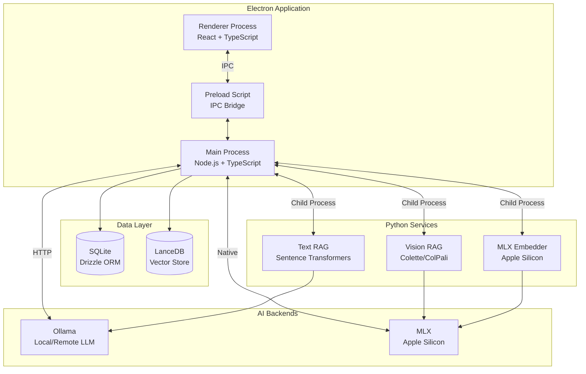
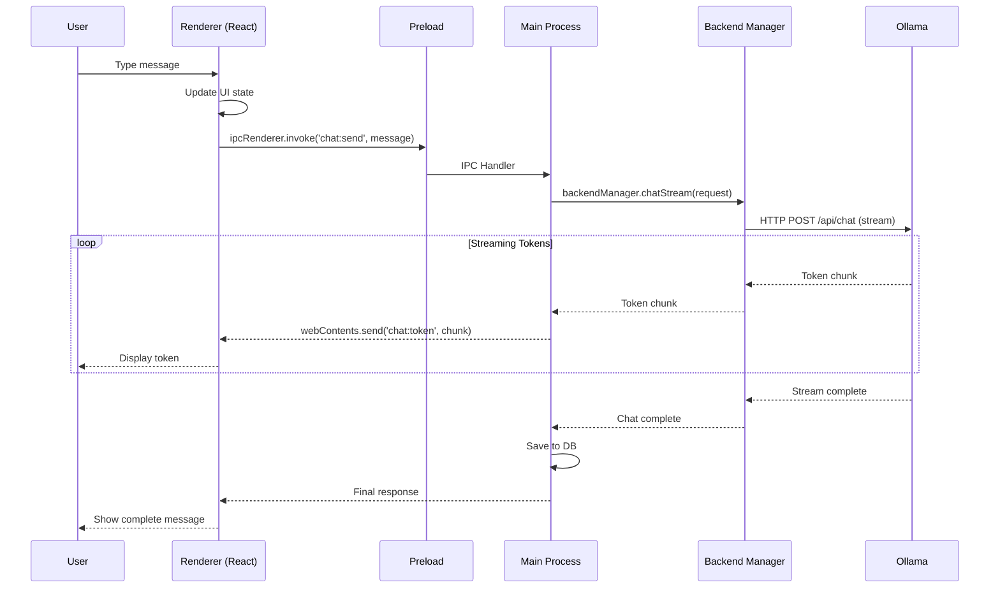
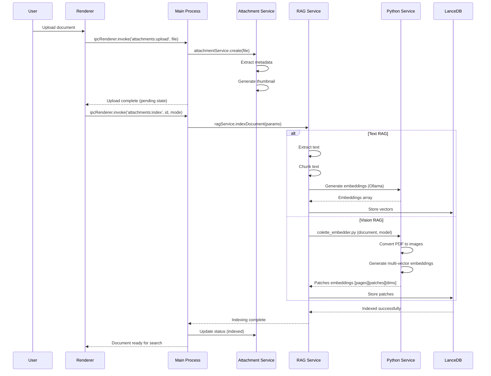
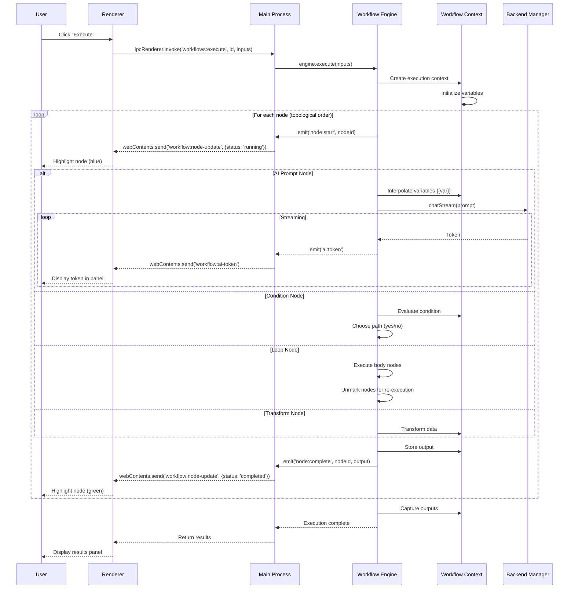
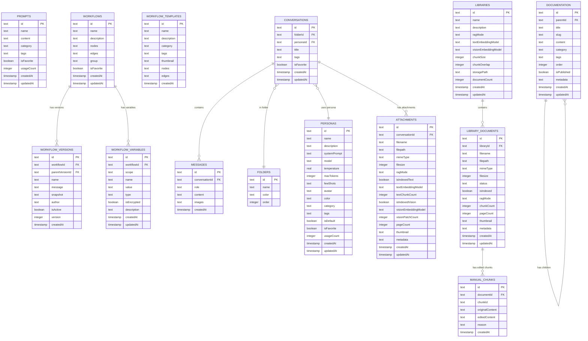
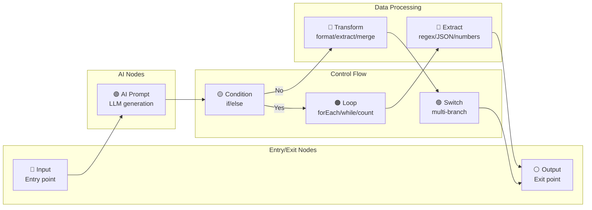
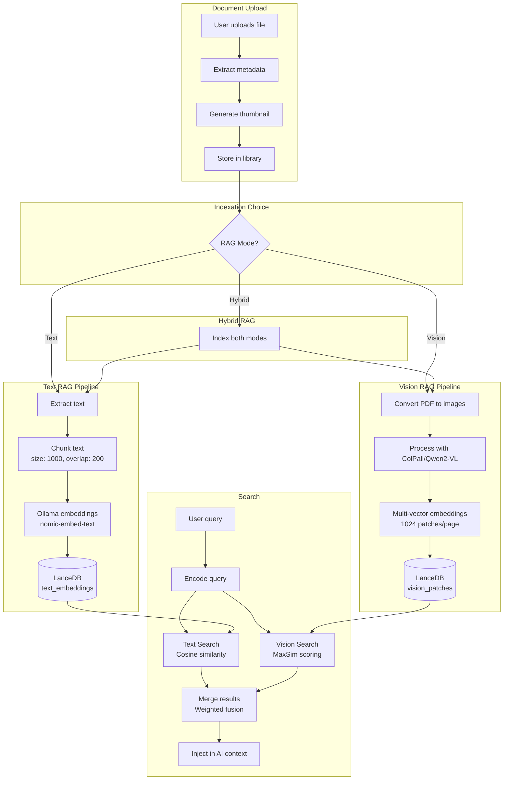
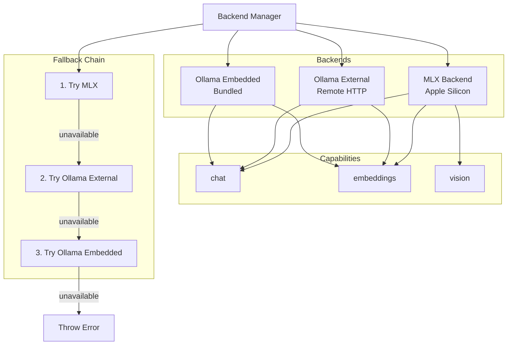
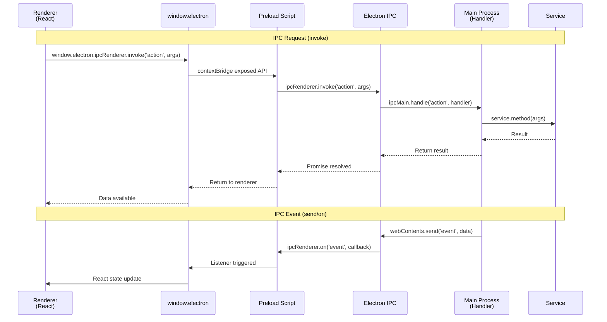
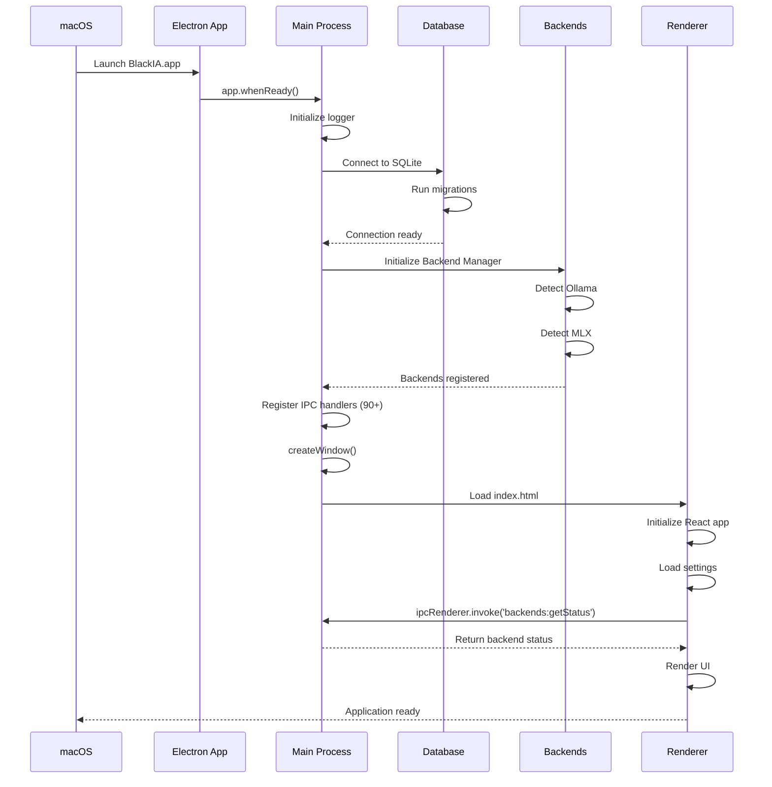

# BlackIA - Diagrammes et Schémas

**Version**: 0.2.0
**Date**: Novembre 2025

Ce document contient tous les diagrammes et schémas de l'architecture BlackIA en format texte (Mermaid, ASCII art).

---

## Table des Matières

1. [Architecture globale](#1-architecture-globale)
2. [Flux de données](#2-flux-de-données)
3. [Schéma de base de données](#3-schéma-de-base-de-données)
4. [Architecture des workflows](#4-architecture-des-workflows)
5. [Système RAG](#5-système-rag)
6. [Backend Manager](#6-backend-manager)
7. [Communication IPC](#7-communication-ipc)
8. [Cycle de vie de l'application](#8-cycle-de-vie-de-lapplication)

---

## 1. Architecture globale

### 1.1 Vue d'ensemble (Mermaid)



### 1.2 Architecture en couches (ASCII)

```
┌─────────────────────────────────────────────────────────────────┐
│                     PRESENTATION LAYER                          │
│  React Components | Pages | Hooks | Context | State (Zustand)  │
└─────────────────────────────────────────────────────────────────┘
                              │
                              ▼
┌─────────────────────────────────────────────────────────────────┐
│                  STATE MANAGEMENT LAYER                         │
│  TanStack Query (Server State) | Zustand (Client State)         │
└─────────────────────────────────────────────────────────────────┘
                              │
                              ▼
┌─────────────────────────────────────────────────────────────────┐
│                  IPC COMMUNICATION LAYER                        │
│  Preload Bridge | IPC Handlers | Event Emitters                │
└─────────────────────────────────────────────────────────────────┘
                              │
                              ▼
┌─────────────────────────────────────────────────────────────────┐
│                  BUSINESS LOGIC LAYER                           │
│  Services (22) | Workflow Engine | Backend Manager | RAG        │
└─────────────────────────────────────────────────────────────────┘
                              │
                              ▼
┌─────────────────────────────────────────────────────────────────┐
│                  DATA ACCESS LAYER                              │
│  Drizzle ORM | LanceDB Client | Filesystem | Python Shell      │
└─────────────────────────────────────────────────────────────────┘
                              │
                              ▼
┌─────────────────────────────────────────────────────────────────┐
│                  EXTERNAL SERVICES                              │
│  SQLite | LanceDB | Ollama HTTP API | Python Services           │
└─────────────────────────────────────────────────────────────────┘
```

---

## 2. Flux de données

### 2.1 Flux Chat (Mermaid)



### 2.2 Flux RAG (Mermaid)



### 2.3 Flux Workflow (Mermaid)



---

## 3. Schéma de base de données

### 3.1 ERD (Entity-Relationship Diagram)



### 3.2 Tables principales (Texte)

```
┌─────────────────────────────────────────────────────────────────┐
│                       CORE TABLES (4)                            │
├─────────────────────────────────────────────────────────────────┤
│ • personas (13 fields)        - AI personalities                │
│ • prompts (12 fields)         - Reusable prompt library         │
│ • conversations (8 fields)    - Chat history                    │
│ • messages (5 fields)         - Individual messages             │
└─────────────────────────────────────────────────────────────────┘

┌─────────────────────────────────────────────────────────────────┐
│                     WORKFLOW TABLES (4)                          │
├─────────────────────────────────────────────────────────────────┤
│ • workflows (9 fields)        - Visual workflows                │
│ • workflowTemplates (9 fields)- Reusable templates              │
│ • workflowVersions (11 fields)- Git-like versioning             │
│ • workflowVariables (9 fields)- Scoped variables                │
└─────────────────────────────────────────────────────────────────┘

┌─────────────────────────────────────────────────────────────────┐
│                      RAG TABLES (4)                              │
├─────────────────────────────────────────────────────────────────┤
│ • attachments (25 fields)     - File attachments with RAG       │
│ • libraries (14 fields)       - Document collections            │
│ • libraryDocuments (25 fields)- Documents in libraries          │
│ • manualChunks (6 fields)     - Manually edited chunks          │
└─────────────────────────────────────────────────────────────────┘

┌─────────────────────────────────────────────────────────────────┐
│                   ORGANIZATION TABLES (2)                        │
├─────────────────────────────────────────────────────────────────┤
│ • folders (4 fields)          - Conversation folders            │
│ • documentation (11 fields)   - Integrated wiki                 │
└─────────────────────────────────────────────────────────────────┘
```

---

## 4. Architecture des workflows

### 4.1 Types de nœuds (Mermaid)



### 4.2 Execution Flow (ASCII)

```
Workflow Execution Flow
═══════════════════════

1. START
   ↓
2. LOAD WORKFLOW
   • Parse nodes & edges from JSON
   • Build adjacency list (graph)
   ↓
3. TOPOLOGICAL SORT
   • Kahn's algorithm
   • Ensures dependencies respected
   ↓
4. CREATE CONTEXT
   • Initialize variables map
   • Set up input values
   • Prepare output collectors
   ↓
5. EXECUTE NODES (in sorted order)
   ↓
   ┌─────────────────────────────────┐
   │  For each node:                 │
   │  ─────────────────────────────  │
   │  ① Mark as "running"            │
   │  ② Send event to UI             │
   │  ③ Execute node logic:          │
   │     • Input → Store in context  │
   │     • AI Prompt → Stream LLM    │
   │     • Condition → Eval & branch │
   │     • Loop → Iterate & recurse  │
   │     • Transform → Process data  │
   │     • Output → Collect result   │
   │  ④ Store output in context      │
   │  ⑤ Mark as "completed"          │
   │  ⑥ Send event to UI             │
   └─────────────────────────────────┘
   ↓
6. COLLECT OUTPUTS
   • Gather all Output node values
   • Build results object
   ↓
7. RETURN RESULTS
   {
     success: true,
     outputs: {...},
     logs: [...],
     duration: 5432ms
   }
```

### 4.3 Variable Interpolation

```
Variable Interpolation System
═════════════════════════════

Context Variables Map:
┌────────────────────────────────────┐
│ input_text: "Hello world"          │
│ ai_response: "Generated content"   │
│ loop_index: 2                      │
│ loop_item: {...}                   │
│ global.author_name: "John Doe"     │
│ env.API_KEY: "***encrypted***"     │
└────────────────────────────────────┘

Prompt Template:
┌────────────────────────────────────┐
│ Résume ce texte pour {{global.     │
│ author_name}} :                    │
│                                    │
│ {{input_text}}                     │
│                                    │
│ Style: Item #{{loop_index}}        │
└────────────────────────────────────┘
              ↓
        INTERPOLATION
              ↓
Resolved Prompt:
┌────────────────────────────────────┐
│ Résume ce texte pour John Doe :    │
│                                    │
│ Hello world                        │
│                                    │
│ Style: Item #2                     │
└────────────────────────────────────┘
```

---

## 5. Système RAG

### 5.1 Architecture RAG globale (Mermaid)



### 5.2 Text RAG Chunking (ASCII)

```
Text RAG - Document Chunking
═════════════════════════════

Original Document (2500 chars):
┌────────────────────────────────────────────────────────────┐
│ Introduction aux conteneurs Docker...                      │
│                                                            │
│ Docker est une plateforme de conteneurisation...          │
│                                                            │
│ [... 2500 caractères ...]                                 │
└────────────────────────────────────────────────────────────┘

Parameters:
• chunk_size: 1000 characters
• chunk_overlap: 200 characters

Chunking Process:
┌────────────────────────────────────────────────────────────┐
│ CHUNK 1 (0-1000)                                           │
│ "Introduction aux conteneurs Docker..."                   │
│ [1000 chars]                                               │
└────────────────────────────────────────────────────────────┘
         │ overlap (200 chars)
         ▼
┌────────────────────────────────────────────────────────────┐
│ CHUNK 2 (800-1800)                                         │
│ "...conteneurisation permet de..."                        │
│ [1000 chars]                                               │
└────────────────────────────────────────────────────────────┘
         │ overlap (200 chars)
         ▼
┌────────────────────────────────────────────────────────────┐
│ CHUNK 3 (1600-2500)                                        │
│ "...Docker compose orchestrate..."                        │
│ [900 chars]                                                │
└────────────────────────────────────────────────────────────┘

Embeddings Generation:
Chunk 1 → [0.12, 0.45, -0.33, ..., 0.78]  (768 dims)
Chunk 2 → [-0.22, 0.67, 0.14, ..., -0.45] (768 dims)
Chunk 3 → [0.55, -0.12, 0.88, ..., 0.32]  (768 dims)
          ↓
    Store in LanceDB
```

### 5.3 Vision RAG avec MaxSim (ASCII)

```
Vision RAG - Multi-Vector Embeddings with MaxSim
═════════════════════════════════════════════════

Document: Technical_Manual.pdf (3 pages)
                ↓
        Convert to Images
                ↓
┌─────────────────────────────────────────────────────┐
│ Page 1          Page 2          Page 3              │
│ [Image]         [Image]         [Image]             │
└─────────────────────────────────────────────────────┘
                ↓
    Process with ColPali/Qwen2-VL
                ↓
┌─────────────────────────────────────────────────────┐
│         Multi-Vector Embeddings (Patches)           │
├─────────────────────────────────────────────────────┤
│ Page 1: [                                           │
│   Patch 1:   [0.12, -0.45, ..., 0.78]  (128 dims)  │
│   Patch 2:   [-0.33, 0.67, ..., -0.22] (128 dims)  │
│   ...                                               │
│   Patch 1024: [0.88, 0.14, ..., 0.55]  (128 dims)  │
│ ]                                                   │
│                                                     │
│ Page 2: [ 1024 patches x 128 dims ]                │
│ Page 3: [ 1024 patches x 128 dims ]                │
└─────────────────────────────────────────────────────┘
                ↓
        Store in LanceDB

Query: "diagram showing authentication flow"
                ↓
        Encode query to multi-vector
                ↓
      Query embedding: [0.45, -0.12, ..., 0.67]
                ↓
┌─────────────────────────────────────────────────────┐
│              MaxSim Scoring Algorithm               │
├─────────────────────────────────────────────────────┤
│ For each page:                                      │
│   For each patch in page:                           │
│     similarity = cosine(query, patch)               │
│   page_score = MAX(all similarities)  ← MaxSim     │
│                                                     │
│ Page 1: max_sim = 0.87  (from patch 234)           │
│ Page 2: max_sim = 0.92  (from patch 567) ← Best    │
│ Page 3: max_sim = 0.76  (from patch 89)            │
└─────────────────────────────────────────────────────┘
                ↓
        Return Page 2 (score: 0.92)
```

---

## 6. Backend Manager

### 6.1 Architecture Backend Manager (Mermaid)



### 6.2 Backend Selection Logic (ASCII)

```
Backend Selection & Fallback
═════════════════════════════

Initial Setup:
┌──────────────────────────────────────────┐
│ Preferred Backend: MLX                   │
│ Fallback Order:                          │
│   1. mlx                                 │
│   2. ollama-external                     │
│   3. ollama-embedded                     │
└──────────────────────────────────────────┘

Request: chat(message)
         ↓
┌──────────────────────────────────────────┐
│ Try Backend #1: MLX                      │
│ ────────────────────────────────────     │
│ • Check availability: isAvailable()      │
│ • Check capability: hasCapability('chat')│
│   → Result: ✅ Available                 │
│   → Execute: mlx.chat(message)           │
└──────────────────────────────────────────┘
         ↓
    Success! Return response

─────────────────────────────────────────────

Request: embeddings(text)
         ↓
┌──────────────────────────────────────────┐
│ Try Backend #1: MLX                      │
│ • Check: hasCapability('embeddings')     │
│   → Result: ❌ Not Available             │
└──────────────────────────────────────────┘
         ↓ Fallback
┌──────────────────────────────────────────┐
│ Try Backend #2: Ollama External          │
│ • Check: hasCapability('embeddings')     │
│   → Result: ✅ Available                 │
│   → Execute: ollama.embed(text)          │
└──────────────────────────────────────────┘
         ↓
    Success! Return embeddings

─────────────────────────────────────────────

Request: vision(image)
         ↓
┌──────────────────────────────────────────┐
│ Try Backend #1: MLX                      │
│ • Check: hasCapability('vision')         │
│   → Result: ❌ Not Available             │
└──────────────────────────────────────────┘
         ↓ Fallback
┌──────────────────────────────────────────┐
│ Try Backend #2: Ollama External          │
│ • Check: hasCapability('vision')         │
│   → Result: ❌ Not Available             │
└──────────────────────────────────────────┘
         ↓ Fallback
┌──────────────────────────────────────────┐
│ Try Backend #3: Ollama Embedded          │
│ • Check: hasCapability('vision')         │
│   → Result: ❌ Not Available             │
└──────────────────────────────────────────┘
         ↓
    ❌ Throw Error: No backend supports 'vision'
```

---

## 7. Communication IPC

### 7.1 Architecture IPC (Mermaid)



### 7.2 Security Model (ASCII)

```
Electron Security Model
═══════════════════════

┌──────────────────────────────────────────────────────┐
│                  Renderer Process                    │
│                 (Untrusted Context)                  │
│  ┌────────────────────────────────────────────────┐  │
│  │          React Application                     │  │
│  │  • No Node.js access                           │  │
│  │  • No filesystem access                        │  │
│  │  • No native modules                           │  │
│  │                                                │  │
│  │  Can only use:                                 │  │
│  │  window.electron.ipcRenderer.*                 │  │
│  └────────────────────────────────────────────────┘  │
└──────────────────────────────────────────────────────┘
                        │
                        │ IPC Bridge
                        ▼
┌──────────────────────────────────────────────────────┐
│                  Preload Script                      │
│               (Isolated Context)                     │
│  ┌────────────────────────────────────────────────┐  │
│  │     contextBridge.exposeInMainWorld()          │  │
│  │                                                │  │
│  │  Exposed API:                                  │  │
│  │  • ipcRenderer.invoke() ✅                     │  │
│  │  • ipcRenderer.on() ✅                         │  │
│  │  • ipcRenderer.send() ✅                       │  │
│  │                                                │  │
│  │  Blocked:                                      │  │
│  │  • Direct IPC access ❌                        │  │
│  │  • Node.js require() ❌                        │  │
│  └────────────────────────────────────────────────┘  │
└──────────────────────────────────────────────────────┘
                        │
                        │ Electron IPC
                        ▼
┌──────────────────────────────────────────────────────┐
│                   Main Process                       │
│                (Trusted Context)                     │
│  ┌────────────────────────────────────────────────┐  │
│  │           IPC Handlers                         │  │
│  │  • Full Node.js access ✅                      │  │
│  │  • Filesystem ✅                               │  │
│  │  • Native modules ✅                           │  │
│  │  • Database ✅                                 │  │
│  │  • Network ✅                                  │  │
│  │                                                │  │
│  │  Security:                                     │  │
│  │  • Validate all inputs                         │  │
│  │  • Whitelist allowed channels                  │  │
│  │  • Sanitize file paths                         │  │
│  └────────────────────────────────────────────────┘  │
└──────────────────────────────────────────────────────┘

Configuration (BrowserWindow):
─────────────────────────────
webPreferences: {
  nodeIntegration: false,      ✅ No Node in renderer
  contextIsolation: true,      ✅ Isolated contexts
  sandbox: false,              ⚠️  Disabled for SQLite
  preload: 'preload/index.js'  ✅ Secure bridge
}
```

---

## 8. Cycle de vie de l'application

### 8.1 Startup Sequence (Mermaid)



### 8.2 Shutdown Sequence (ASCII)

```
Application Shutdown Sequence
═════════════════════════════

User clicks "Quit" or Cmd+Q
          ↓
┌────────────────────────────────────┐
│ 1. app.on('before-quit')           │
│    • Save application state        │
│    • Flush logs                    │
└────────────────────────────────────┘
          ↓
┌────────────────────────────────────┐
│ 2. window.on('close')              │
│    • Save window position/size     │
│    • Cleanup renderer resources    │
└────────────────────────────────────┘
          ↓
┌────────────────────────────────────┐
│ 3. Backend Manager cleanup         │
│    • Stop streaming requests       │
│    • Disconnect Ollama             │
│    • Shutdown MLX                  │
└────────────────────────────────────┘
          ↓
┌────────────────────────────────────┐
│ 4. Database cleanup                │
│    • Commit pending transactions   │
│    • Close SQLite connection       │
│    • WAL checkpoint                │
└────────────────────────────────────┘
          ↓
┌────────────────────────────────────┐
│ 5. Python subprocess cleanup       │
│    • Kill active Python processes  │
│    • Clean temp files              │
└────────────────────────────────────┘
          ↓
┌────────────────────────────────────┐
│ 6. app.on('will-quit')             │
│    • Final cleanup                 │
│    • Remove event listeners        │
└────────────────────────────────────┘
          ↓
┌────────────────────────────────────┐
│ 7. app.quit()                      │
│    • Exit application              │
└────────────────────────────────────┘
          ↓
    Process terminated
```

---

**Fin des Diagrammes et Schémas**

*Ces diagrammes peuvent être rendus avec :*
- **Mermaid**: https://mermaid.live/ ou intégration VSCode
- **PlantUML**: Pour diagrammes UML plus complexes
- **ASCII**: Directement lisibles en texte brut

*Dernière mise à jour: Novembre 2025*
*Version du document: 1.0*
